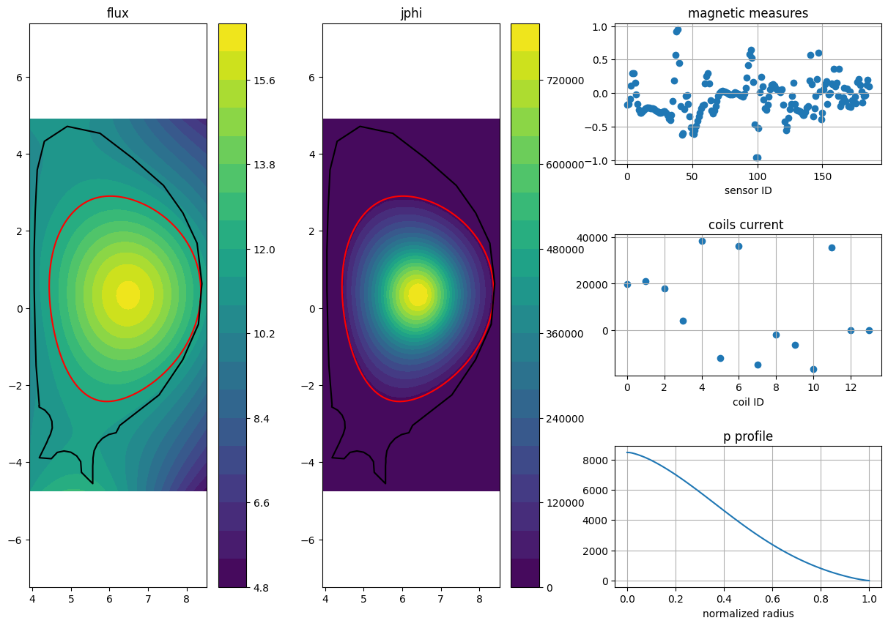

# ITER-like equilibrium dataset

### Description
This repo contains a Collection of 81986 synthetic equilibria of an ITER-like device useful to develop Machine-Learning-based surrogate models of 2D plasma equilibrium reconstruction. It is the official dataset used in the development of the PlaNet model and `planet-equil` (see [this repo](https://github.com/matteobonotto/planet-equil)). 

The dataset comes in 2 versions:
- a sample version of ~8.2K equilibria (see [in huggingface](https://huggingface.co/datasets/matteobonotto/iterlike-equil-sample))
- the full version of ~82K equilibria (see [in huggingface](https://huggingface.co/datasets/matteobonotto/iterlike-equil))

The equilibrium dataset has been generated using the IET [1] and FRIDA [2] codeds (code repo [here](https://github.com/DA2412/IET_Inverse_Equilibrium_Tool.git) and [here](https://github.com/matteobonotto/FRIDA.git)). 


### Installation
To install the dataset, simply run
```shell
pip install git+https://github.com/matteobonotto/ITERlike-equilibrium-dataset.git
```


### Use the dataset
Once the repo has been istalled, the datasets can be accessed as:
```python
from iterlike_equil_dataset import IterlikeDataset
from iterlike_equil_dataset.plot import contourf, plot_equilibrium

dataset = IterlikeDataset(
  dataset_id='matteobonotto/iterlike-equil-sample'
)

equilibrium = dataset[0]

# print the dataset summary
print(dataset)

''' Expected output
ITER-like equilibrium dataset with 8192 samples and keys:
 mag_measures
 flux
 rhs
 coils_current
 separatrix
 is_diverted
 p_profile
'''

# plot a single sample
plot_equilibrium(equilibrium)
```
expected output:




Alternatively, the dataset can be accessed as a normal huggingface dataset without installing this repo (although the previous way is recommended):
```python
from datasets import load_dataset

dataset = load_dataset('matteobonotto/iterlike-equil-sample')
```

### Example
A full example on how to use the data can be found in the notebook [use_dataset.ipynb](notebooks/use_dataset.ipynb).


### Citations
If you foung the data useful, please consider citing these papers!
```
@article{bonotto2022coupled,
  title={A coupled FEM-BEM approach for the solution of the free-boundary axi-symmetric plasma equilibrium problem},
  author={Bonotto, M and Abate, D and Bettini, P and Villone, F and others},
  journal={Commun. Comput. Phys.},
  volume={31},
  number={1},
  pages={27--59},
  year={2022}
}
```
```
@article{abate2019inverse,
  title={An inverse equilibrium tool to define axisymmetric plasma equilibria},
  author={Abate, Domenico and Bettini, Paolo},
  journal={Plasma Physics and Controlled Fusion},
  volume={61},
  number={10},
  pages={105016},
  year={2019},
  publisher={IOP Publishing}
}
```


